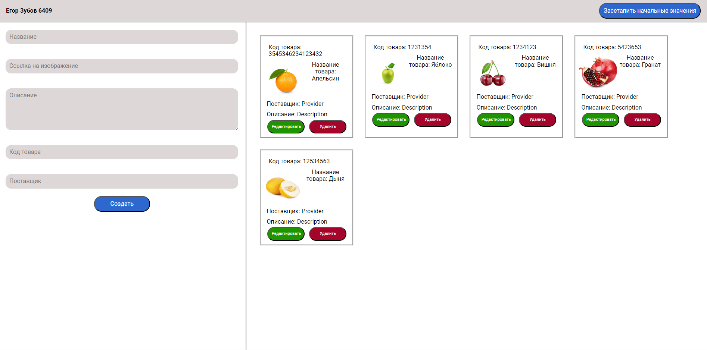
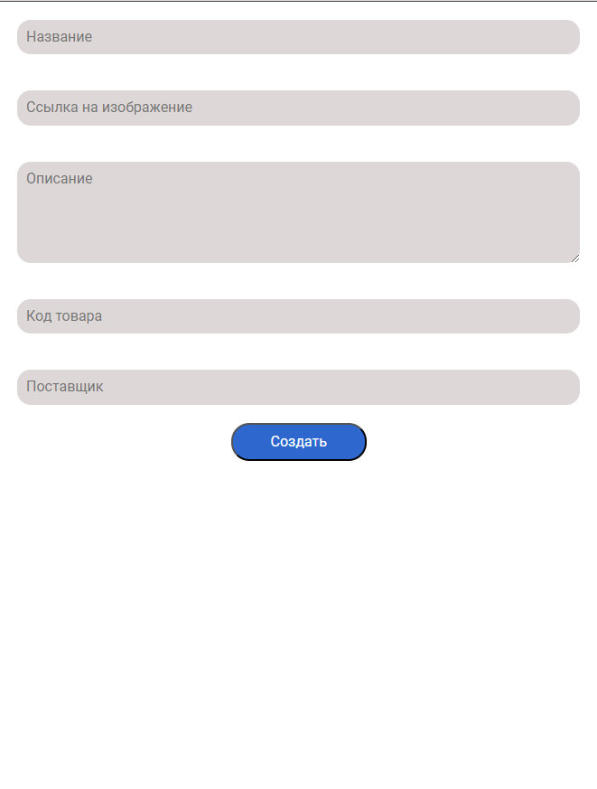
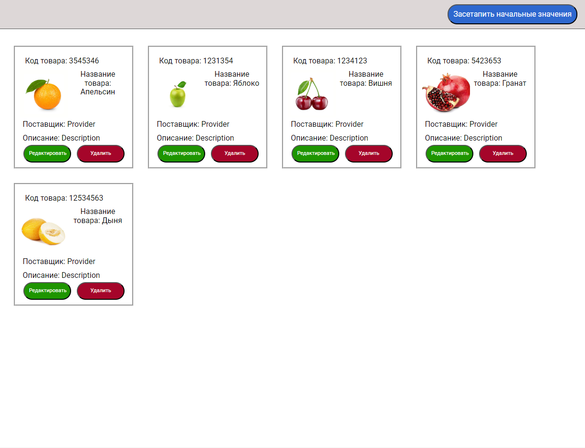
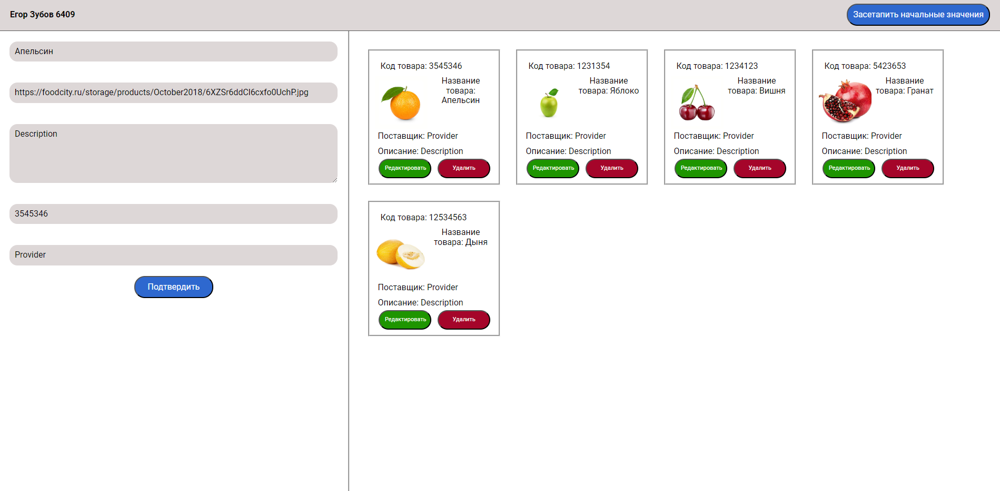

Админка карточек:

С помощью данной формы можно создавать карточки:

Помимо этого, имеется возможность задания начальных карточек:

Карточки можно удалять с помощью кнопки удалить на карточке, а также редактировать. После нажатия на кнопку редактирования, информация с карточки переносится в форму и редактируется непосредственно с формы. После нажатия кнопки подтверждения, карточка сохраняется.

Для запуска сервера необходимо выполнить следующие команды:
    1) npm install -g json-server
    2) json-server --watch database.json
